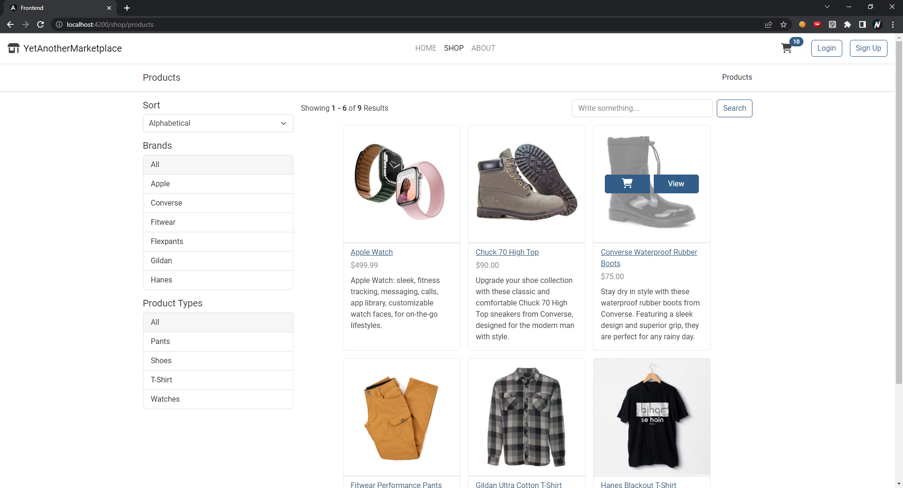
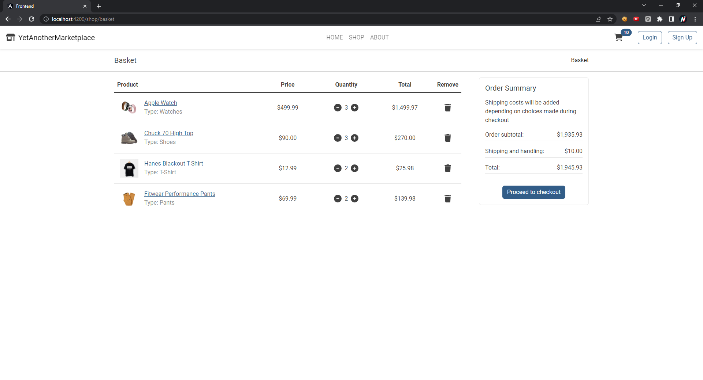
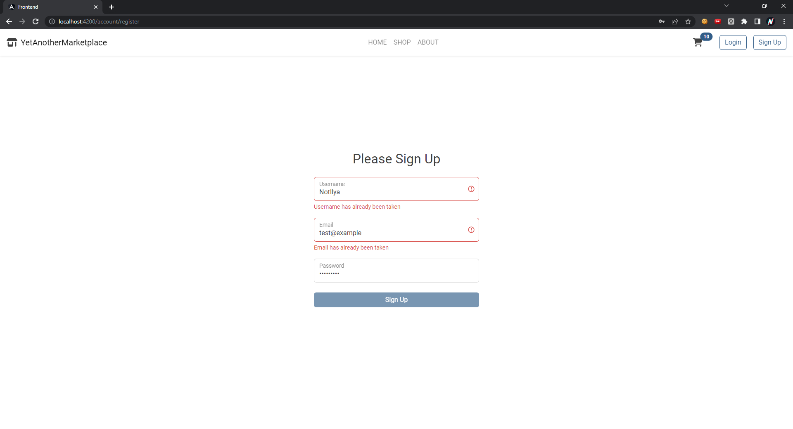

# Frontend
This is an Angular frontend app for YetAnotherMarketplace. It speaks with backend via gateway. Currently site hasn't responsive/adaptive html, its done primary for desktop screens. It has authorization, interceptor handles jwt token expiry and refreshes it with refresh token.

## Screenshots
### Products main page

### Basket page

### Login/Register page

## Pages
- `Shop` This page contains list of products with searching, sorting, filtering and pagination. Navigate: `localhost:4200/shop/products`.
- `Basket` This is a basket management page, you can increase/decrease/delete products in basket. Navigate: `http://localhost:4200/shop/basket`.
- `Login/Register` This is a login/register form. Navigate: `localhost:4200/account/login`, `localhost:4200/account/register`.